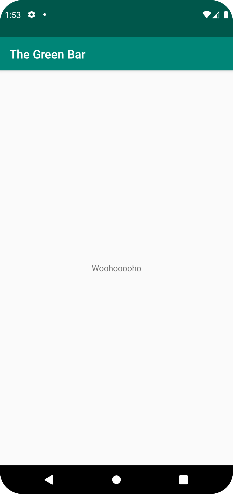

# Rapport

Jag har ändrat texten som finns på appens menyrad, samt texten som finns mitt på skärmen. 
För att göra detta ändrades först stringen i "strings.xml", genom att hello skrevs som The Green Bar.
En till string gjordes kallad "below_name" för att göra den andra texten.
```
<resources>
    <string name="app_name">The Green Bar</string>
    <string name="below_name">Woohooooho</string>
</resources> 
```

Den nya stringen kopplades inuti textview-taggen i activity_main.xml
```
<TextView
    android:layout_width="wrap_content"
    android:layout_height="wrap_content"
    android:text="@string/below_name"
    app:layout_constraintBottom_toBottomOf="parent"
    app:layout_constraintEnd_toEndOf="parent"
    app:layout_constraintStart_toStartOf="parent"
    app:layout_constraintTop_toBottomOf="@+id/appBarLayout" />
  ```

Resultat:



